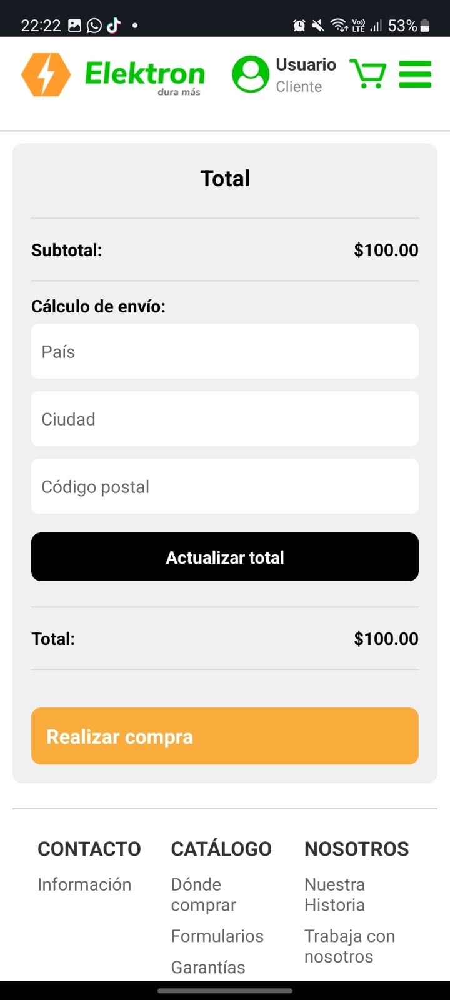
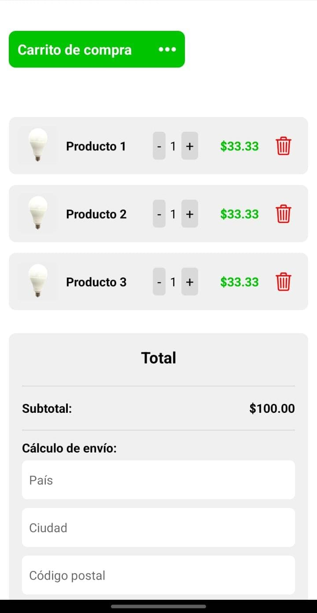
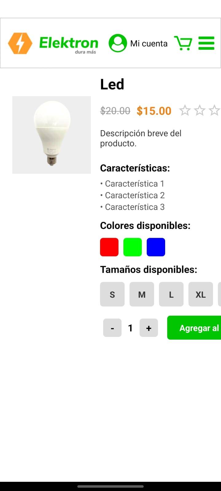
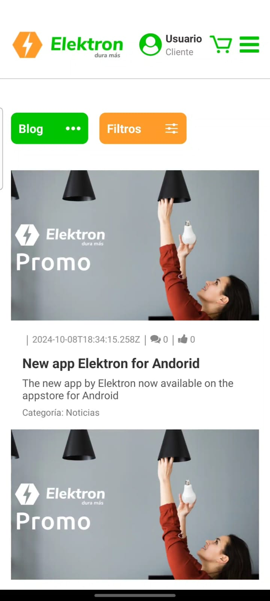

# Elektron B2B Mobile – Frontend (React Native)

This repository contains the mobile frontend part of the B2B eCommerce solution developed for Elektron.

The code was written using React Native and represents **a work-in-progress**, not a final production version.

📌 **Note:** This repository only includes my personal contribution to the project, and is intended to serve as a record of my development work for professional purposes.

## 🛠️ Technologies Used

- [React Native](https://reactnative.dev/)
- [Expo](https://expo.dev/)
- [React Navigation](https://reactnavigation.org/)
- [Fetch API](https://developer.mozilla.org/en-US/docs/Web/API/Fetch_API)
- [TypeScript](https://www.typescriptlang.org/)

## 🎯 Repository Purpose

This repository was created to **showcase my personal work** within the Elektron B2B Mobile project.  
It serves as a **portfolio piece**, allowing me to share and document my contributions using modern tools like React Native.

During my time on the project, I was responsible for:
- Setting up the base structure of the mobile app using React Native and Expo
- Implementing navigation with React Navigation
- Creating and styling views and components
- Connecting the app to backend services using the Fetch API
- Managing component-level state and handling user interaction

> Due to professional considerations, only my part of the project is included.

## 📸 Screenshots

Here are some screenshots of the mobile app:

## ⚠️ Usage Note

This project is not intended to run as a standalone application, since it depends on services and backend components that are not included in this repository.

Its purpose is to showcase the code structure and my development work within the mobile frontend.

## 👤 Author and License

**Enzo Agustín Melgarejo**  
[LinkedIn](https://www.linkedin.com/in/enzo-melgarejo-818862239/) | [Portfolio](https://my-portfolio-dev-enzo.netlify.app/) | enzomelgarejo@gmail.com

---

© 2025 Enzo Agustín Melgarejo. All rights reserved.

## 🚧 Project Status

This version represents a **development snapshot** of the mobile frontend.  
The complete project is finished, but this repository contains **only my in-progress work** at the time of my participation.

